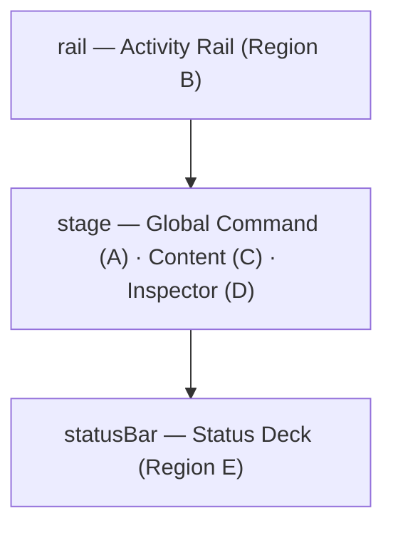

# UI/UX Design System

This document describes the architectural principles, layout strategy ("Zoning"), and interaction models of the JustSearch user interface. It serves as the source of truth for the application's visual and functional design.

## 1. Design Philosophy

JustSearch is designed as a **HUD (Heads-Up Display)** for your digital life. The interface prioritizes speed, data density, and keyboard navigability, wrapping complex AI operations in a calm, glassmorphic aesthetic.

### Core Tenets
*   **"Glass" Aesthetic:** The UI uses backdrop blurring (`backdrop-filter: blur(20px)`) and translucency to feel lightweight and native.
*   **Native Integration:** The UI masquerades as a native OS utility by using system fonts and standard interaction patterns.
*   **Keyboard First:** Every primary action (Search, Navigation, Mode Switching) is accessible via hotkeys.
*   **Zone-Based Layout:** The screen is divided into strict functional areas ("Zones") to maintain spatial consistency.
*   **Ambient Status:** System health, AI inference modes, and indexing status are passive indicators that don't block user flow.

## 2. The Zoning System

The application layout is defined declaratively in
`modules/ui-web/src/shell-v0/layout/LayoutManifest.ts`, which composes three
**structural zones** — `rail`, `stage` (exclusive), and `statusBar` — into named
presets (`core.default`, `core.focus`). The shell chrome renders them as
`<jf-rail>` / `<jf-stage>` and the status deck.

The five **functional regions** described below map onto those three structural zones:

| Functional region | Structural zone |
|---|---|
| Activity Rail (navigation) | `rail` |
| Global Command (top input bar) | `stage` region (header) |
| Stage (main content) | `stage` |
| Inspector (right detail panel) | `stage` region (collapsible right sub-panel) |
| Status Deck (bottom telemetry) | `statusBar` |

### Zone B: Activity Rail (Navigation)
*   **Location:** Left vertical strip.
*   **Purpose:** Top-level navigation between major views.
*   **Components:**
    *   **Chat:** (Home) The one interaction window — search, grounded Q&A, and agent runs in escalating intent tiers (tempdoc 577 Goal 3). It **lands in the `retrieve` base tier** (instant file search, no model required); when a chat model is online it auto-escalates the landing to **Documents** (grounded Q&A), so the pure-search landing is the offline / bare state. Past conversations stay reachable from the retrieve landing via the "Continue your last conversation?" card (restoring *loads* a thread to read; only a new turn needs the model). The standalone Search window was retired as a rail peer — Placement DEEPLINK, still URL-routable for the rich facet/trace surface.
    *   **Library:** Manage indexed folders.
    *   **Brain:** AI Model Configuration & VRAM Monitoring (also surfaces index schema mismatch / reindex-required state).
    *   **System:** System diagnostics and telemetry (hosts Health / Logs / Activity).
    *   **Settings:** General application preferences.

### Zone A: Global Command (Hybrid Input)
*   **Location:** Top horizontal bar.
*   **Purpose:** The primary input vector for the application.
*   **Modes:**
    *   **Search Mode:** Default. Type to search files.
    *   **Command Mode:** Prefix `/`. Activates system commands (e.g., `/reindex`). Visualized as a purple pill.
    *   **Chat Mode:** Prefix `??` or `ask`. Switches input to a multi-line textarea for AI Q&A. Visualized with a teal border.
*   **Features:**
    *   Ghost text autocomplete (`Tab` to accept).
    *   Debounced inputs for local vs. remote search.
    *   **Search history dropdown:** Shows recent searches on focus when query is empty (localStorage-backed, max 30 entries, deduplicated). Individual entries can be removed.
    *   **Syntax help button:** A `?` button next to the SIMPLE/LUCENE mode toggle shows a popover with mode-specific guidance (Lucene operators table or Simple mode description).
    *   **Window drag region:** Empty space in the header bar acts as a drag handle for the frameless Tauri window (`-webkit-app-region: drag`). Input fields and buttons are excluded.

### Zone C: Stage (Main Content)
*   **Location:** Center viewport.
*   **Purpose:** Displays the active view's content.
*   **Views:**
    *   **Launchpad:** Empty Search state that teaches prerequisites and gives quick entry points:
        *   **Get started ladder:** Add folder → check status → try an example query (chips).
        *   **Quick cards:** Add folder, Configure AI, Health, Actions.
    *   **Mode-specific empty states:** When no results/content exist, the Stage shows context-appropriate guidance:
        *   *Search mode:* "No results" with filter suggestions.
        *   *Command mode (`/`):* Terminal icon with "No matching command" and help hint.
        *   *Chat mode (`??`):* Message icon with "Ask a question" and usage hint.
    *   **Result List:** Virtualized list of search results with keyboard navigation (`↑`/`↓`).
        * Uses container-query responsive layouts so result cards adapt cleanly as the Stage width changes.
        * **Cursor vs selection:** arrow keys move a cursor (highlight) without opening the Inspector; `Enter` commits selection and opens the Inspector.
        * When the Inspector is closed and nothing is selected, Search can show a right-side **Browse** panel (focused preview + actions) to avoid dead space.
    *   **Library Manager:** Tree view of watched paths.
    *   **Brain Configuration:** Sliders for Context Window, Temperature, and Model Path inputs.
        * When AI is not installed, the Simple panel shows a "What you get" capabilities list (Q&A, summarization, semantic search) to motivate installation.
        * When schema incompatibility is detected, the Brain view surfaces a clear "Rebuild Index" call-to-action and reason.
        * When semantic search (chunk vectors) is still backfilling, the Brain view surfaces readiness/progress so the UI can say "semantic search ready" vs "building" deterministically.
    *   **Health Dashboard:** Real-time charts of RAM/CPU/Index.

### Zone D: Inspector Panel
*   **Location:** Right vertical panel (Collapsible).
*   **Purpose:** "Details on Demand".
*   **Content:**
    *   **File Metadata:** Path, size, modified date, MIME type.
    *   **Answer-first AI output:** the AI response is presented above trust UI and Preview so "Summarize" feels immediate. During streaming, progress phases (searching → reading → writing) are shown with animated dots.
    *   **Trust UI:** context capacity (limit/used), RAG/partial/fallback, truncation, and Sources/citations remain visible during streaming. Citation buttons (`[1]`, `[2]`) show hover cards with document name, match percentage, and excerpt preview. A **retrieval mode badge** (HYBRID / BM25 / FULLTEXT) indicates how chunks were selected, with a tooltip showing the reason code.
    *   **Preview:** Paged extracted text preview (loaded via `GET /api/preview`), collapsible when AI is active.
        * Preview also surfaces `vduStatus` + `textProvenance` so users can see whether text came from Tika extraction, Tika/Tesseract OCR, or VDU. When OCR evidence is available, the source line can include compact confidence, fallback, truncation, or skip details.
    *   **AI Insights:** Auto-generated summaries, key entities.
    *   **Chat/Q&A:** The output of AI queries ("Brain" results) is rendered here alongside the source document.
    *   **Actions:** "Open Folder", "Reindex", "Copy Path".

### Zone E: Status Deck (Telemetry)
*   **Location:** Bottom horizontal bar.
*   **Purpose:** Ambient system feedback.
*   **Indicators:**
    *   **Connectivity:** Green/Red wifi icon for Backend connection.
    *   **Index Stats:** Total documents, Index size, Memory usage.
    *   **AI Mode:** "Online" (Brain active) vs "Indexing" (Embeddings active).
    *   **Queues:** **Only visible when active.** Shows pending VDU or Embedding job counts (e.g., "5 VDU pending").
    *   **Process Button:** Appears only when queues are non-zero, allowing manual trigger of offline processing.

## 3. Key Interaction Models

### The Search Flow
1.  **Input:** User types in Zone A.
2.  **Local vs Remote:**
    *   Short queries (< 3 chars) filter local history/cache.
    *   Long queries trigger backend Lucene search.
3.  **Narrowing controls (Zone C):** A filter bar sits above results:
    *   **Scope**: dropdown of indexed roots (sets `pathPrefix`)
    *   **Type**: `file_kind` buckets (PDF/Markdown/Images/…)
    *   **Sort**: Relevance / Newest / Oldest (TEXT mode)
    *   **Date / Language**: DocValues-backed filters
    *   **Facets**: optional facet counts (first page only)
    *   Active filters are shown as removable chips, with a one-click “Clear”.
4.  **Typo Correction:** If a query returns zero hits and a fuzzy match finds better results, the response includes `correctionApplied: true` and `correctedQuery`. Zone C shows a banner: "Showing results for **X** instead of *Y*". Per-term correction also replaces results when a corrected query returns significantly more hits.
5.  **Results:** Rendered in `VirtualResultList` (Zone C) with a highlighted snippet sourced from `content_preview`.
6.  **Pagination:** When more results exist, Zone C shows a **Load more** control (cursor-based paging for TEXT mode).
7.  **Browse (cursor) vs select (commit):**
    *   Arrow keys move a **cursor** (highlighted row) without opening the Inspector.
    *   `Enter` commits selection and opens the Inspector.
    *   Hover may update the cursor, but does not commit selection.
8.  **Multi-selection + batch AI:**
    *   Checkboxes manage a `selectedIds` set for batch actions (summarize / ask across multiple files).
    *   Clicking a result row toggles its checkbox AND opens the Inspector (no separate "checkbox then click row" dance). `Ctrl/Cmd+Click` toggles the checkbox without changing the single selection.
9.  **Open vs Inspect (keyboard):**
    *   `Enter`: inspect (open Inspector).
    *   `Ctrl/Cmd+Enter`: open file (Desktop) or best-effort open preview (Browser).
    *   The Action Panel is the primary action surface for selection-based commands (`Ctrl/Cmd+Shift+P`).

### Implicit Interactions
*   **Drag & Drop:** Dropping folders onto the application window (Zone C) automatically adds them to the Index and starts ingestion.
*   **Context Menus:** Right-clicking any result item opens a native-style menu with:
    *   *Primary:* Open, Reveal in Explorer, Copy Path.
    *   *AI:* Summarize, Find Similar.
    *   *System:* Re-index File.

### AI Mode Switching
The system operates in two mutually exclusive modes to manage GPU VRAM:
*   **Online Mode:** LLM is loaded. Chat and Search QA are available. Embeddings are paused.
*   **Indexing Mode:** Embedding model is loaded. New files are vectorized. LLM is unloaded.

**Transition:**
*   Users can manually toggle via the "Brain" view (Settings).
*   "Process Now" in Zone E triggers offline processing (VDU + embedding backfill) via `POST /api/offline/process` and reflects progress via `/api/inference/status`.

## 4. Visual Language & Accessibility

### Glass Material
*   Backgrounds use `backdrop-filter: blur(20px)` to blend with the desktop wallpaper.
*   Borders are semi-transparent white (`rgba(255,255,255,0.1)`).

### Typography
*   **Font:** **System Native Stack.** The app inherits the OS font to feel like a built-in utility.
    *   *Windows:* Segoe UI
    *   *macOS:* San Francisco
    *   *Linux:* System Default
*   **Monospace:** JetBrains Mono (for paths, code, and hotkeys).
*   **Scale:** Small (11px) for status, Regular (13px) for content, Large (16px) for headers.

### Categorical Semiotics
Files are visually distinguished by subtle color coding on icons and borders to aid peripheral scanning:
*   **Documents (PDF/Docx):** Muted Blue / Slate.
*   **Images (PNG/JPG):** Muted Purple / Lavender.
*   **Code (JS/Py):** Muted Teal / Cyan.
*   **Data (CSV/Excel):** Muted Green / Emerald.
*   **Archives (Zip):** Muted Orange / Amber.

### Theme System
The UI supports three theme modes, selectable in Settings → Appearance:
*   **System:** Follows the OS `prefers-color-scheme` media query. Listens for live OS changes via `matchMedia`.
*   **Dark:** Default. Designed for the glassmorphic aesthetic.
*   **Light:** Adapted glass surfaces, stronger borders, and inverted text primitives. All colors resolve through CSS custom property tokens in `tokens.css`.

Theme preference is persisted to both `localStorage` (instant recall) and the backend settings API. A FOUC-prevention inline script in `<head>` reads the saved theme before the first paint.

#### Design Token Architecture
All colors are defined as CSS custom properties in `tokens.css` (~90 semantic tokens + 10 primitives). Zero hardcoded theme-breaking colors in component code (1 intentional residual: the white toggle knob in the toggle control, `shell-v0/renderers/controls/ToggleSwitchRenderer.ts` / `<jf-toggle>`).

**Three-layer token system:**
1.  **Primitives** — base values that switch per-theme:
    *   `--p-glass` (RGB channels: white in dark, navy in light) — used by all glass/surface tokens
    *   `--p-shadow` (RGB channels) — used by all shadow tokens
    *   `--p-text` (RGB channels: white in dark, slate in light) — used by all text tokens
    *   7 OKLCH hue constants (`--h-teal`, `--h-purple`, `--h-green`, `--h-amber`, `--h-red`, `--h-blue`, `--h-magenta`) — theme-invariant
2.  **Semantic tokens** — purpose-named tokens composed from primitives (e.g., `--glass-surface: rgba(var(--p-glass), 0.06)`)
3.  **Tailwind `@theme inline`** — maps tokens to utility classes (e.g., `bg-glass-surface`)

Adding a 3rd theme requires overriding 3 RGB primitives + tuning per-theme lightness/chroma/opacity. Glass and text tokens auto-adapt.

### Accessibility
*   **High Contrast Mode:** A dedicated mode that removes transparency and enforces strict black/white contrast (detected via OS preference or manual toggle in Settings).
*   **Focus Rings:** All interactive elements have visible focus states for keyboard navigation.
*   **Hotkeys:** Global hotkeys are hinted in Zone E (Status Deck) when the `Alt` key is held.
*   **ARIA Roles:** Result list uses `role="grid"` / `role="row"` / `role="gridcell"`. Context menus use `role="menu"` / `role="menuitem"`. Multi-select checkboxes use `role="checkbox"` with `aria-checked`.
*   **Zone Focus Management:** Tab cycling between zones moves DOM focus to the target zone's primary element (input or container) via `requestAnimationFrame`, enabling immediate keyboard interaction after zone switch.
*   **Destructive Action Confirmation:** Reset to Defaults and Restart Worker require a confirmation dialog (`warning` variant) before executing.
*   **WCAG Contrast Verification:** All views pass WCAG AA color-contrast (4.5:1 normal text, 3:1 large text) in both dark and light themes, verified by `@axe-core/playwright` scans integrated into the evidence bundle capture script (`--a11y-scan` flag).

## 5. User readiness notes (living doc)

While the UI is still evolving, the current workflow verification checklist and known issues are tracked in:

- `docs/reference/ui-user-readiness.md`
