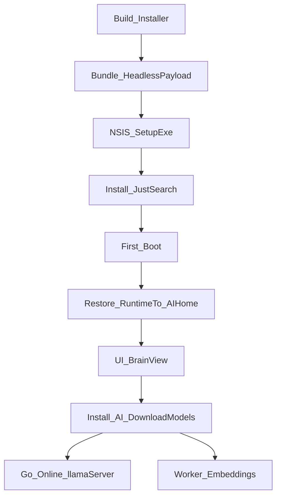

# 13. AI Setup + Verification (Current State)

This document describes the **current production behavior** for JustSearch v2/v3 AI setup and how we verify it.
It is intentionally descriptive: it explains **what the system does today** and how to prove it works.

## 1. What v2/v3 ships (high-level)

JustSearch ships:

- A **Windows NSIS installer** (`*-setup.exe`) that installs the Tauri desktop app.
- A bundled **headless backend bundle** (Java + Worker) inside the Tauri resources.
- A bundled **CPU-only** `llama-server` runtime payload (pinned upstream llama.cpp build) used for Online mode by default.
- An **in-app “Install AI” (v1 flow)** that downloads and verifies pinned GGUF model files (after explicit consent).
- **Offline AI Pack import (v2+)** for models packs and **runtime packs** (zip or folder), allowlist-gated by manifest digest.
- **Enterprise policy (v2)** loaded from machine/user policy files, exposed via `GET /api/policy/effective`.
- Diagnostics export (`POST /api/diagnostics/export`) to bundle logs + policy + pack state for support.

v3 adds **GPU Booster Pack** support (runtime variant packs + activation) while keeping CPU as the safe default.

## 2. Key directories (“AI Home”)

In desktop bundles, the Tauri shell sets `JUSTSEARCH_HOME` to the OS app-data directory (“AI Home”) and ensures these exist:

- `<JUSTSEARCH_HOME>/models/` – downloaded or BYO GGUF model files
- `<JUSTSEARCH_HOME>/native-bin/llama-server/` – restored `llama-server.exe` runtime payload
- `<JUSTSEARCH_HOME>/native-bin/onnxruntime/` – optional ONNX Runtime native payloads installed via runtime packs (used for reranker GPU acceleration when available)
- `<JUSTSEARCH_HOME>/logs/` – `headless-backend.log`, `worker.log`, `llama-server.log`

Additional v2 state files under AI Home:

- `<JUSTSEARCH_HOME>/installed-packs.v1.json` — record of installed offline packs
- `<JUSTSEARCH_HOME>/pack-import-state.json` — last import job status
- `<JUSTSEARCH_HOME>/ai/runtime-activation-state.json` — last runtime activation job status (v3)
- `<JUSTSEARCH_HOME>/policy.v1.json` — optional user policy file (power-user/enterprise)
- `<JUSTSEARCH_HOME>/diagnostics/` — exported diagnostic bundles (zip)

On Windows this resolves to the user’s roaming app data folder (example):

- `%APPDATA%\\io.justsearch.shell\\`

## 3. Bundling + restore flow (runtime payload)

### 3.1 Build-time bundling

At build time, Gradle stages the headless bundle into:

- `modules/shell/src-tauri/resources/headless/**`

This includes `native-bin/llama-server/**` (CPU runtime payload).

### 3.2 Runtime restore into AI Home

On app startup, the Tauri shell restores the bundled runtime payload into AI Home:

- Source: `<resources>/headless/native-bin/llama-server/`
- Destination: `<JUSTSEARCH_HOME>/native-bin/llama-server/`

The restore is directory-based (exe + adjacent DLLs). The shell also supports upgrades by overwriting the AI Home runtime when the bundled `runtime-version.txt` changes.

### 3.3 Runtime variant selection (dev vs production)

Two independent code paths resolve which `llama-server` executable is used. They are separate by design:

**Path A — Discovery (fail-safe, CPU default):**
`InferenceConfig.findServerExecutable(baseDir)` picks the baseline CPU binary. Resolution order:

1. `JUSTSEARCH_SERVER_EXE` env var / `justsearch.server.exe` system property (explicit override)
2. `<baseDir>/native-bin/llama-server/llama-server.exe` (canonical baseline path)
3. Subdirectory scan under `native-bin/llama-server/` (sorted, **skips `variants/`**)
4. Fallback to the canonical path (even if missing — validation catches it later)

The `variants/` directory is skipped intentionally. Variants are not auto-discovered — they must be explicitly activated.

**Path B — Activation (opt-in, GPU self-test):**
`RuntimeActivationService.startActivate(variantId)` installs and verifies a GPU-capable variant:

1. Resolves `<variantsRoot>/<variantId>/llama-server.exe` (e.g., `variants/cuda12/`)
2. Runs a bounded self-test (30s timeout): starts the variant on an ephemeral port, sends a health check + small chat request, measures VRAM delta
3. On success: persists the exe path to UiSettings + sets `justsearch.server.exe` system property (which overrides Path A on next startup)
4. On failure: rolls back, CPU baseline remains active

This design ensures CPU always works out of the box, while GPU activation is explicit, tested, and reversible.

**For developers:** To test with the GPU variant without the UI activation flow, set the system property directly:

```text
-Djustsearch.server.exe=modules/ui/native-bin/llama-server/variants/cuda12/llama-server.exe
```

See also: `docs/how-to/test-gpu-locally.md`.

## 4. "Install AI" (models) flow

v1 model acquisition is **in-app** (not installer-time) for reliability and consent:

- Manifest (bundled): `modules/ui/src/main/resources/ai/model-registry.v2.json`
- Backend service: `modules/ui/src/main/java/io/justsearch/ui/ai/install/AiInstallService.java`
- UI entry point: `modules/ui-web/src/shell-v0/views/BrainSurface.ts`

Key properties:

- Downloads are **hash-pinned** (SHA-256) and written atomically (partial → verify → rename).
- On Windows, downloads prefer **BITS** with a **curl.exe** fallback.
- State persists under AI Home (`install-state.json`).

## 4.1 Offline AI Pack import (v2+, models + runtime)

v2+ supports offline import of allowlisted packs (zip or extracted folder):

- API:
  - `POST /api/ai/packs/preflight` (compute manifest digest; no install)
  - `POST /api/ai/packs/import`
  - `GET /api/ai/packs/status`
  - `GET /api/ai/packs/installed`
  - policy helpers (desktop, unmanaged machines only):
    - `POST /api/policy/user/create` (create user policy if missing)
    - `POST /api/policy/user/allowlist/pack-manifest/add` (append digest to existing user policy allowlist; opt-in)
- v3 (runtime activation):
  - `GET /api/gpu/capabilities`
  - `GET /api/ai/runtime/status`
  - `POST /api/ai/runtime/activate`
  - `POST /api/ai/runtime/deactivate`
- UI entry point: `modules/ui-web/src/shell-v0/views/BrainSurface.ts`

Security posture (fail closed):

- Pack must be allowlisted by manifest SHA-256 (policy/app allowlist).
- Every payload file is size + SHA-256 verified.
- Extra/undeclared payload files are rejected.

See:

- `docs/explanation/14-ai-pack-spec.md`
- `docs/explanation/15-enterprise-policy.md`

## 5. Verification: what we run and what “PASS” means

### 5.1 Phase 1 (deterministic, host automation)

Script:

- `scripts/ci/verify-installer-nsis-win.ps1`

What it proves:

- The produced `*-setup.exe` installs silently (per-user).
- The installed payload contains a runnable `resources/headless/**` bundle.
- The bundled backend reaches readiness:
  - `GET /api/status` → `indexAvailable=true`
  - `GET /api/health` → HTTP `200` and `components.worker.state == "READY"` (lifecycle schema v1; inference may be `DEGRADED` without blocking readiness)
- The bundled llama-server payload files are present under `resources/headless/native-bin/llama-server/`.

### 5.2 Phase 3 (clean machine UI validation)

Windows Sandbox harness:

- Harness: `scripts/sandbox/sandbox-launch.py` (launches Windows Sandbox and drives the offline-installer validation)

What it proves:

- Real install UX works on a clean machine (WebView2, first boot).
- In-app “Install AI” works (consent → download → verify).
- Q&A and embeddings work end-to-end.

### 5.3 v3 verification (GPU Booster Pack + activation)

This checklist validates that v3 GPU Booster Pack support is wired end-to-end.

**Step A: confirm GPU capabilities detection**

- Call `GET /api/gpu/capabilities`.
- PASS indicators:
  - `nvml.available=true` on an NVIDIA machine (NVML-first detection).
  - `nvidia.driverVersion` and VRAM totals are present when available.

**Step B: import a runtime pack (installed, not yet active)**

- Use `POST /api/ai/packs/preflight` on the runtime pack zip/folder to compute the `manifestSha256`.
- Ensure the pack is allowlisted (policy/app allowlist), then `POST /api/ai/packs/import`.
- PASS indicators:
  - `GET /api/ai/packs/status` reports `status=SUCCEEDED`.
  - `GET /api/ai/packs/installed` shows the runtime pack entry (kind `runtime`, with `variantId`).

**Step C: activate the runtime variant**

- Call `POST /api/ai/runtime/activate` with `{"variantId":"cuda-12.4"}` (or the installed variant id).
- PASS indicators:
  - `GET /api/ai/runtime/status` reports the activation job as `SUCCEEDED`.
  - Online inference uses the activated variant (see Step D log proof).

**Step D: prove GPU offload and `gpuLayers` are applied (log evidence)**

- Open `<JUSTSEARCH_HOME>/logs/llama-server.log` and find the most recent model load.
- PASS indicators:
  - CUDA backend loads (example): `load_backend: loaded CUDA backend from ...\\ggml-cuda.dll`
  - Offload is reported (example): `load_tensors: offloaded X/Y layers to GPU`
    - `X=0` means CPU-only.
    - `X>0` means GPU is in use.
    - This is the most reliable “did `-ngl` apply?” signal.

## 6. Evidence to capture when something fails

Copy these from AI Home:

- `<JUSTSEARCH_HOME>/logs/headless-backend.log`
- `<JUSTSEARCH_HOME>/logs/worker.log`
- `<JUSTSEARCH_HOME>/logs/llama-server.log` (if Online mode was started)

Also capture snapshots:

- `GET /api/status`
- `GET /api/health`
- `GET /api/inference/status`
- `GET /api/gpu/capabilities` (v3)
- `GET /api/policy/effective` (v2)
- `GET /api/ai/packs/status` (v2)
- `GET /api/ai/runtime/status` (v3)

## 7. Known limitations (intentional)

- **CPU-only runtime in v1**: Online mode runs on CPU by default.
- **Runtime packs are installed but not auto-activated**: activation is explicit and gated by policy + self-test (v3).
- **GPU “booster” is NVIDIA-only (v3)**: hardware-awareness chooses a CUDA-capable runtime via an allowlisted offline pack only when the machine can use it (CPU remains the default safe path).
- **Windows Sandbox GPU validation is environment-dependent**: CUDA tooling may be missing even when a GPU is visible. Prefer real NVIDIA hardware for definitive performance/VRAM validation; see `docs/explanation/16-gpu-booster-pack.md`.

## 8. System flow (diagram)


