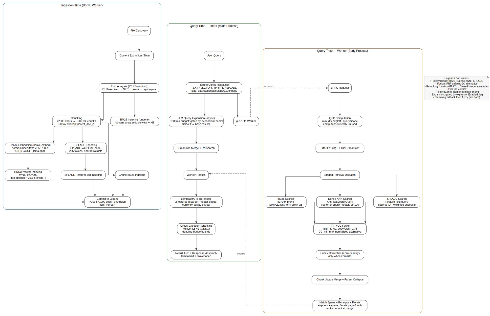

# 23. Search Pipeline Overview

JustSearch's search pipeline spans two processes (Head and Body) and is
split into ingestion-time (offline, index-building) and query-time (online,
search-serving) stages. This document traces the full path end-to-end.

> **Decision register:** For settled findings, canonical baselines, and open questions about search quality, see `docs/reference/search-quality-register.md`.

For subsystem deep-dives, see:
- [04-storage-engine.md](04-storage-engine.md) — Lucene schema, fields, commit strategy
- [18-adapters-lucene-deep-dive.md](18-adapters-lucene-deep-dive.md) — BM25, HNSW, hybrid fusion internals
- [05-ai-architecture.md](05-ai-architecture.md) — Embedding backend, VRAM management
- [03-knowledge-server.md](03-knowledge-server.md) — Indexing loop, Tika extraction, job queue

---

## How a Search Request Works

When a user types a query, the default `hybrid` preset activates BM25 +
Dense KNN retrieval (with optional SPLADE), fused via CC (convex
combination). The pipeline executes across two processes:

1. **Head** (Main process, `KnowledgeHttpApiAdapter`) resolves the
   `PipelineConfig` from a named preset or explicit flags, and optionally
   starts an async LLM expansion call. It then sends a gRPC request to the
   Worker.

2. **Worker** (Body process, `SearchOrchestrator`) runs retrieval. The
   enabled legs (BM25, Dense KNN, SPLADE) execute in parallel via virtual
   threads. Their results are fused (RRF by default). If the query yields
   zero hits, fuzzy correction retries. If chunks exist, a parallel chunk
   search is fused and collapsed by parent document. Match spans, excerpt
   regions, and facets are computed. The response flows back over gRPC.

3. **Head** (post-retrieval) merges any completed LLM expansion, then runs
   a reranking cascade: LambdaMART (fast, ~5 ms) followed by cross-encoder
   (deep, 200–500 ms). Results are trimmed to the requested limit and
   per-hit provenance metadata is assembled.

The diagram below shows the complete flow. The three retrieval legs fan out
in parallel from the dispatch stage. Dashed lines indicate the cross-process
gRPC boundary.

---

## Pipeline Configuration

Pipeline behavior is controlled by `PipelineConfig` — a set of independent
boolean flags that replaced the legacy `SearchMode` enum.

Each flag independently enables a pipeline component. Named **presets**
provide backwards-compatible aliases:

| Preset     | `sparse` | `dense` | `splade` | `expansion` | `crossEncoder` | Notes                                            |
| ---------- | -------- | ------- | -------- | ----------- | -------------- | ------------------------------------------------ |
| **text**   | ✓        | —       | —        | ✓           | ✓*             | Sort, cursor, facets, fuzzy correction available |
| **hybrid** | ✓        | ✓       | opt      | —           | ✓*             | Default for interactive search                   |
| **vector** | —        | ✓       | —        | —           | ✓*             | Pure semantic similarity                         |
| **splade** | —        | —       | ✓        | ✓           | ✓*             | Learned sparse retrieval                         |

\* Cross-encoder and LambdaMART are enabled when their models are loaded.

Custom `PipelineConfig` objects can combine flags freely — e.g.,
`{sparse, splade}` or `{dense, splade}` produce valid results through
composable dispatch.

### TEXT-Only Features

Sort modes, cursor pagination, facets, and fuzzy correction require Lucene's
`Query`-based collector API. They are available only when sparse retrieval
is the **sole** active leg. This is a Lucene API constraint, not a mode gate.

---

## Ingestion-Time Stages (Body Process)

These stages run in the Worker (`indexer-worker`). They build the index that
query-time stages search against.

| #   | Stage                    | Owner                          | What It Does                                                                                  |
| --- | ------------------------ | ------------------------------ | --------------------------------------------------------------------------------------------- |
| 1   | **File Discovery**       | `IndexingLoop`                 | Polls job queue, checks timestamps, respects breath holding                                   |
| 2   | **Content Extraction**   | `StructuredContentExtractor`   | Uses `AutoDetectParser.parse()` + `StructuredContentHandler`; preserves headings, tables, page breaks from 1,400+ formats; sandboxed with timeout + memory guards. PDFs with low quality scores (< 0.3) are routed to VLM extraction via the Brain process when `JUSTSEARCH_LAYOUT_ENABLED=true` — see [ADR-0018](../decisions/0018-vlm-pdf-extraction-via-chat-model.md) |
| 3   | **Text Analysis**        | `SsotAnalyzerRegistry`         | `ICUTokenizer → NFC → LowerCase` — locale-invariant, no per-language analyzer ([ADR-0043](../decisions/0043-multilingual-by-construction-no-per-language-levers.md))  |
| 4   | **Chunking**             | `ChunkDocumentWriter`          | Splits docs >2,000 chars into 500-token chunks (50-token overlap); linked via `parent_doc_id` |
| 5   | **BM25 Indexing**        | `FieldMapper` / `WritePathOps` | `content` as analyzed text; `content_preview` (first ~4 KB) for snippets                      |
| 6   | **Dense Embedding**      | `EmbeddingService` (llama.cpp) | gte-multilingual-base, 768-dim; `vector` (whole-doc) + `chunk_vector` (per-chunk)             |
| 7   | **SPLADE Encoding**      | `SpladeEncoder`                | opensearch-neural-sparse-encoding-multilingual-v1 (12L BERT-multilingual, 105K vocab) → Lucene `FeatureField` entries |
| 8a  | **NER Backfill**         | `NerBackfillOps`               | Writes `entity_persons_raw`, `entity_organizations_raw`, `entity_locations_raw` (keyword) and `entity_persons_text`, `entity_organizations_text`, `entity_locations_text` (ICU-analyzed) fields (326) |
| 8   | **HNSW Vector Indexing** | `JustSearchCodec`              | M=16, efConstruction=200; Int8 quantization optional (~75% storage reduction)                 |
| 9   | **Commit**               | `CommitOps`                    | On time (>10 s), size (>1,000 docs), or shutdown; NRT refresh                                 |

---

## Query-Time Stages

### Retrieval Legs

Three retrieval models can run in any combination:

| Leg                         | Model / Engine                  | Index Field                 | Key Parameters                                  |
| --------------------------- | ------------------------------- | --------------------------- | ----------------------------------------------- |
| **BM25** (sparse)           | Lucene BM25                     | `content` / `chunk_content` | k1=0.9, b=0.4; SIMPLE prefix expansion ≥3 chars; `combineMultiField()` builds `DisjunctionMaxQuery` with up to 6 disjuncts: `content` + `title`×3.0 + 3 entity text fields×2.0 (326). Entity boost configurable via `ResolvedConfig.Search.entityBoost()`, default 0.0 (disabled per F-010) |
| **Dense** (KNN)             | gte-multilingual-base (768-dim)                                          | `vector` / `chunk_vector`   | ef_search=100; HNSW M=16                        |
| **SPLADE** (learned sparse) | opensearch-neural-sparse-encoding-multilingual-v1 (12L BERT-multilingual, 105K vocab) | `FeatureField` entries      | Optional IDF-weighted query encoding            |

### Pre-Retrieval (Head — `KnowledgeHttpApiAdapter`)

| #   | Stage                           | What It Does                                                                                                                                                |
| --- | ------------------------------- | ----------------------------------------------------------------------------------------------------------------------------------------------------------- |
| 1   | **Pipeline Config Resolution**  | Expands preset or accepts explicit `PipelineConfig` with flags: `sparseEnabled`, `denseEnabled`, `spladeEnabled`, `expansionEnabled`, `crossEncoderEnabled` |
| 2   | **LLM Query Expansion** (async) | 1,500 ms budget; morphological variants; gated by `expansionEnabled` flag (true for text/splade presets); falls back to base results on timeout             |
| 2a  | **Filter Value Normalization** (async) | Two-tier: deterministic prefix/contains matching (0 ms); LLM grammar-constrained enum fallback (~400–1200 ms GPU). Gated by `JUSTSEARCH_FILTER_NORM_ENABLED`. Fires on both search and answer paths (366) |
| 2b  | **Query Understanding** (async) | LLM extracts `boostFilters` from natural language queries; applied as `BooleanClause.SHOULD` + `BoostQuery(ConstantScoreQuery, weight=20)`. Gated by `JUSTSEARCH_QU_ENABLED`. Bypassed when explicit filters present (363) |

### Retrieval (Worker — `SearchOrchestrator`)

Stages 3–8 are **not sequential** — stages 6, 7, and 8 execute in parallel
via virtual threads, then converge at the fusion stage.

| #   | Stage                                 | What It Does                                                                                                                                                        |
| --- | ------------------------------------- | ------------------------------------------------------------------------------------------------------------------------------------------------------------------- |
| 3   | **QPP Computation**                   | `maxIdf`, `avgIctf`, `queryScope` per query term; O(1) via IndexReader; forwarded but not yet used for routing                                                      |
| 4   | **Filter Parsing + Entity Expansion** | gRPC filters → Lucene queries; entity facet filters expanded via disambiguation cluster snapshot                                                                    |
| 5   | **Staged Retrieval Dispatch**         | Dispatches to enabled legs; standard combos use optimized methods (`searchHybrid`, `searchHybridSplade`); novel combos use pairwise RRF fusion via `fuseLegs()`     |
| 6   | **BM25 Search** ‖                     | Lucene `Query`-based retrieval; fetches 3× limit for over-retrieval                                                                                                 |
| 7   | **Dense KNN Search** ‖                | `KnnFloatVectorQuery`; fetches 2× limit; pre-filtered by runtime filters                                                                                            |
| 8   | **SPLADE Search** ‖                   | `FeatureField` query with learned sparse weights                                                                                                                    |
| 9   | **CC / RRF Fusion**                   | **CC** (default): min-max normalized convex combination with per-leg weights; **RRF** (alternative): `score = Σ(weight / (K + rank)) + bm25_boost × raw_score` (K=60, vectorWeight=0.75). 3-way variant (`fuseWithCC3`) available when SPLADE is active |
| 10  | **Low-Signal Gating**                 | Caps vector-only results (default 3) when vector top score <0.40; prevents semantic hijack                                                                          |
| 11  | **Stop-Word Short-Circuit**           | Skips vector search for trivial queries (<4 chars or single stop words)                                                                                             |
| 12  | **Fuzzy Correction** (zero-hit retry) | Two-stage: (a) full Levenshtein fuzzy retry, (b) per-term replacement of zero-docFreq terms; only when zero hits on SIMPLE queries                                  |

‖ = parallel execution

### Post-Retrieval (Worker — `SearchOrchestrator`)

Stages 13a–13c implement **two-branch fusion**: a whole-document branch
(stages 6–9 above) and a chunk branch (13a–13b) are independently scored,
collapsed, and then merged in 13c. This replaces the earlier single-pass
RRF chunk merge.

| #    | Stage                                      | What It Does                                                                                                                                                                                                                                                |
| ---- | ------------------------------------------ | ----------------------------------------------------------------------------------------------------------------------------------------------------------------------------------------------------------------------------------------------------------- |
| 13a  | **Chunk Branch Retrieval** (Stage 3a)      | Parallel chunk-level BM25 (`searchChunksText`), KNN (`searchChunkVector`), and SPLADE (`searchChunksSplade`) within `executeChunkBranchFusion`. Budget starts at `limit × CHUNK_INITIAL_CANDIDATE_MULTIPLIER`; retries at higher budget if any leg saturates |
| 13b  | **Chunk 3-Way CC Fusion + Parent Collapse** | `fuseWithCC3` combines the three chunk legs via min-max normalized convex combination. SPLADE weight is modulated by `parent_token_count` (full weight ≤1,024 tokens, zero ≥4,096 tokens — compensates for SPLADE's 256-token truncation). Results are collapsed to parent doc ID: best chunk score wins; evidence debug scores (`chunk_sparse`, `chunk_vector`, `chunk_splade`) aggregate by max across sibling chunks |
| 13c  | **Branch Fusion** (Stage 3b)               | Merges whole-doc branch with collapsed chunk-parent branch. Default strategy is CC (`fuseWithCCNamed`): chunk branch weight is modulated by parent length (short docs trust whole branch, long docs trust chunk branch; `chunkMinMultiplier` default 0.25). Alternative: RRF (`fuseWithRRFNamed`) when `branchFusionStrategy=rrf` |
| 14   | **Match Spans + Excerpts + Facets**        | Character-offset spans for UI highlighting; IDF-weighted excerpt regions (top 3); DocValues facets first page only; entity canonical merge                                                                                                                 |

### Post-Retrieval (Head — `KnowledgeHttpApiAdapter`)

| #   | Stage                                 | What It Does                                                                                                       |
| --- | ------------------------------------- | ------------------------------------------------------------------------------------------------------------------ |
| 15  | **Expansion Merge**                   | If LLM expansion completed in budget, re-searches with expanded query (LUCENE syntax); otherwise uses base results |
| 16  | **LambdaMART Reranking**              | 2 features (sparse + vector debug scores); fast (~5 ms); runs first in cascade. **Off by default** (requires a GPL-trained model). ⚠️ **GPL-trained LambdaMART is measured non-viable on real queries** (synthetic GPL training queries don't transfer) — see register **F-021**. Treat as present-but-inert substrate pending real user-feedback labels, *not* a current quality lever |
| 17  | **Cross-Encoder Reranking**           | gte-multilingual-reranker-base (FP16 GPU, 306M params); Head sends `Rerank` gRPC RPC to Worker with query-focused snippets; deadline-budgeted; runs on LambdaMART's output (360) |
| 18  | **Result Trim + Provenance Assembly** | Trim to requested limit; structured provenance per hit (which legs contributed, fusion scores, CE scores)          |

---

## Alternate Entry Points

The interactive search pipeline above is the primary path. Two other paths
share the same Lucene index but have their own orchestration:

**RAG Retrieval** (`RagContextOps`, `indexer-worker`): Used by AI chat.
Retrieves chunks using BM25 or hybrid (BM25 + vector) search, then
optionally reranks with a cross-encoder (GPU-aware, with deadline and VRAM
arbitration). Applies MMR diversification to avoid redundant passages, then
assembles context within a token budget. Falls back to full-document
retrieval with virtual chunking when no indexed chunks exist. Unlike the
interactive pipeline, RAG retrieval is chunk-first (optimized for passage
extraction) and runs entirely in the Worker process.

**Autocomplete / Suggest** (`SuggestOps`, `adapters-lucene`): Prefix and
infix autocomplete on document titles and content. Builds a disjunctive
BM25 query across title and content fields (title boosted 4×), deduplicates
by filename. Independent of the full search pipeline — no fusion, no
reranking, no chunking.

---

## Degradation and Fallback

The pipeline degrades gracefully when components are unavailable:

| Condition                      | Behavior                  | Signaled via              |
| ------------------------------ | ------------------------- | ------------------------- |
| Dense embeddings unavailable   | HYBRID falls back to TEXT | `hybridFallback` + reason |
| Dense embeddings blocked       | VECTOR returns empty      | `vectorBlocked` + reason  |
| SPLADE encoder absent          | SPLADE leg skipped        | `spladeSkipReason`        |
| Cross-encoder model not loaded | CE step skipped           | `crossEncoderSkipReason`  |
| LambdaMART model not loaded    | LambdaMART step skipped   | `lambdaMartSkipReason`    |
| LLM unavailable                | Expansion skipped         | `expansionSkipReason`     |
| QU unavailable (Brain offline) | QU skipped, no boostFilters applied | `queryUnderstanding` absent from response |
| FilterNormalization timeout    | Fallback to case-only normalization | `filterNormalization.source = "timeout"` |

Every search response includes the unified `searchTrace` (tempdoc 549) — the single
stage-keyed artifact carrying per-stage status (`executed` / `skipped` / `disabled` / `failed`
+ reason) and timing (`ms`), plus query-level `effectiveMode` / `decisionKind` / `qpp` /
`degradation`. It replaced the former `pipelineExecution` / `introspection` / per-hit
`debugScores` / `provenance` representations. See
[Search & RAG Reason Codes](../reference/contracts/search-and-rag-reason-codes.md)
for the full degradation contract.

---

## Constraints

- **Cross-encoder** is eligible for all presets. It runs on the fused
  candidate list regardless of which retrieval legs produced it.
- **LLM Expansion** is gated by the `expansionEnabled` flag. The `hybrid`
  preset defaults to `false` (dense retrieval already provides semantic
  recall), but custom configs can override.
- **LambdaMART + Cross-Encoder** co-execute in a 2-stage cascade.
  LambdaMART runs first (fast), cross-encoder on LambdaMART's top-K (deep).
- **Stemming + Fuzzy** are sequential, never simultaneous, to avoid
  double-counting variant terms.

See [Search Pipeline Invariants](../reference/contracts/search-pipeline-invariants.md)
for the full contract and test references.

---

## Source Code Map

| Component                     | Primary File                   | Module            |
| ----------------------------- | ------------------------------ | ----------------- |
| Search orchestration (Worker) | `SearchOrchestrator.java`      | `indexer-worker`  |
| Head-side adapter + reranking | `KnowledgeHttpApiAdapter.java` | `app-services`    |
| Lucene runtime ops (read/write/lifecycle) | `ReadPathOps` / `WritePathOps` / `RunningRuntime` | `adapters-lucene` |
| Hybrid fusion (RRF + CC)      | `HybridFusionUtils.java`       | `adapters-lucene` |
| BM25 query building           | `TextQueryOps.java`            | `adapters-lucene` |
| Chunk retrieval               | `ChunkSearchOps.java`          | `adapters-lucene` |
| Cross-encoder reranker        | `CrossEncoderReranker.java`    | `reranker`        |
| SPLADE encoder                | `SpladeEncoder.java`           | `indexer-worker`  |
| Dense embedding               | `EmbeddingService.java`        | `indexer-worker`  |
| Field mapping                 | `FieldMapper.java`             | `adapters-lucene` |
| Analyzer pipeline             | `SsotAnalyzerRegistry.java`    | `adapters-lucene` |
| Pipeline presets              | `PipelineConfigs.java`         | `ipc-common`      |
| RAG context retrieval         | `RagContextOps.java`           | `indexer-worker`  |
| Autocomplete / suggest        | `SuggestOps.java`              | `adapters-lucene` |
| Query understanding           | `QueryUnderstandingService.java` | `app-services`  |
| Context sufficiency           | `ContextSufficiencyService.java` | `app-services`  |
| Filter normalization          | `FilterNormalizationService.java` | `app-services` |
| NER backfill                  | `NerBackfillOps.java`          | `worker-services` |
| BIO tag decoding              | `BioTagDecoder.java`           | `worker-services` |

For tuning parameters (RRF K, vector weights, BM25 k1/b, HNSW M, ef_search),
see [18-adapters-lucene-deep-dive.md § Configuration](18-adapters-lucene-deep-dive.md).
