# Module Dependencies (Gradle)

This document is **generated** from `settings.gradle.kts` and `modules/**/build.gradle.kts`.

Regenerate (updates the generated section in-place):

```powershell
node scripts/architecture/module-deps.mjs --update-canonical
```

Verify (fails when the generated section is stale):

```powershell
node scripts/architecture/module-deps.mjs --check-canonical
```

<!-- GENERATED:MODULE_DEPS:BEGIN -->
<!-- Generated by: node scripts/architecture/module-deps.mjs -->

### A1. Gradle project inventory

**Included in `settings.gradle.kts`:**
- `:modules:*` (34 JVM projects)
- `:reports` (test/coverage aggregation project)

**Not Gradle projects (invoked by the build):**
- `modules/ui-web` (Lit/Vite/TailwindCSS frontend)
- `modules/shell` (Tauri/Rust desktop wrapper)

### A2. Direct internal dependencies (production)

Legend: `A -> B` means `A` declares a direct Gradle project dependency on `B` in its main `dependencies {}` block.

**Foundation (no internal deps)**
- `:modules:api-contract-projection-java`
- `:modules:core`
- `:modules:core-contracts`
- `:modules:dead-code-audit`
- `:modules:extension-substrate`
- `:modules:infra-core`
- `:modules:prompt-support`
- `:modules:ssot-tools`
- `:modules:telemetry`
- `:modules:test-support`

**With dependencies**
- `:modules:adapters-lucene` -> `:modules:configuration`, `:modules:core`, `:modules:indexing`
- `:modules:ai-backend` -> `:modules:app-api`
- `:modules:app-agent` -> `:modules:app-agent-api`, `:modules:app-api`, `:modules:configuration`, `:modules:telemetry`
- `:modules:app-agent-api` -> `:modules:extension-substrate`
- `:modules:app-api` -> `:modules:api-contract-projection-java`, `:modules:app-agent-api`, `:modules:configuration`
- `:modules:app-api-tck` -> `:modules:ai-backend`
- `:modules:app-config` -> `:modules:configuration`
- `:modules:app-inference` -> `:modules:app-api`, `:modules:configuration`, `:modules:core-contracts`, `:modules:gpu-bridge`, `:modules:telemetry`
- `:modules:app-launcher` -> `:modules:app-agent`, `:modules:app-api`, `:modules:app-config`, `:modules:app-services`, `:modules:app-util`, `:modules:configuration`, `:modules:indexer-worker`, `:modules:telemetry`, `:modules:ui`
- `:modules:app-observability` -> `:modules:app-agent-api`, `:modules:app-api`, `:modules:app-config`, `:modules:app-util`, `:modules:configuration`, `:modules:infra-core`, `:modules:ipc-common`, `:modules:prompt-support`
- `:modules:app-services` -> `:modules:ai-backend`, `:modules:api-contract-projection-java`, `:modules:app-agent`, `:modules:app-agent-api`, `:modules:app-api`, `:modules:app-config`, `:modules:app-inference`, `:modules:app-observability`, `:modules:app-util`, `:modules:configuration`, `:modules:core`, `:modules:gpu-bridge`, `:modules:indexing`, `:modules:infra-core`, `:modules:ipc-common`, `:modules:ort-common`, `:modules:reranker`, `:modules:telemetry`
- `:modules:app-util` -> `:modules:configuration`
- `:modules:benchmarks` -> `:modules:adapters-lucene`, `:modules:configuration`, `:modules:indexing`, `:modules:ort-common`, `:modules:reranker`
- `:modules:configuration` -> `:modules:core-contracts`
- `:modules:gpu-bridge` -> `:modules:configuration`
- `:modules:indexer-worker` -> `:modules:adapters-lucene`, `:modules:ai-backend`, `:modules:configuration`, `:modules:core-contracts`, `:modules:indexing`, `:modules:ipc-common`, `:modules:ort-common`, `:modules:reranker`, `:modules:telemetry`, `:modules:worker-core`, `:modules:worker-services`
- `:modules:indexing` -> `:modules:adapters-lucene`, `:modules:core`
- `:modules:ipc-common` -> `:modules:app-api`
- `:modules:ort-common` -> `:modules:configuration`
- `:modules:reranker` -> `:modules:configuration`, `:modules:ort-common`, `:modules:telemetry`
- `:modules:system-tests` -> `:modules:adapters-lucene`, `:modules:ai-backend`, `:modules:ipc-common`
- `:modules:ui` -> `:modules:adapters-lucene`, `:modules:ai-backend`, `:modules:api-contract-projection-java`, `:modules:app-agent`, `:modules:app-agent-api`, `:modules:app-api`, `:modules:app-config`, `:modules:app-inference`, `:modules:app-observability`, `:modules:app-services`, `:modules:app-util`, `:modules:configuration`, `:modules:core`, `:modules:core-contracts`, `:modules:gpu-bridge`, `:modules:indexing`, `:modules:ipc-common`, `:modules:ort-common`, `:modules:telemetry`
- `:modules:worker-core` -> `:modules:adapters-lucene`, `:modules:ai-backend`, `:modules:configuration`, `:modules:indexing`, `:modules:ort-common`, `:modules:telemetry`
- `:modules:worker-services` -> `:modules:adapters-lucene`, `:modules:ai-backend`, `:modules:app-api`, `:modules:configuration`, `:modules:core-contracts`, `:modules:extension-substrate`, `:modules:indexing`, `:modules:ipc-common`, `:modules:ort-common`, `:modules:reranker`, `:modules:telemetry`, `:modules:worker-core`

### A2.1 Test-only coupling (high-signal)

These edges exist only in test suites and should not be treated as production layering:

- `:modules:app-launcher` uses `testImplementation` on `:modules:gpu-bridge`
- `:modules:dead-code-audit` uses `testImplementation` on `:modules:$m`
- `:modules:system-tests` uses `testImplementation` on `:modules:app-services`, `:modules:indexer-worker`, `:modules:worker-services`

### A3. Build dependency graph (production)

```mermaid
graph TD
  dead-code-audit["dead-code-audit"]
  ssot-tools["ssot-tools"]
  test-support["test-support"]
  adapters-lucene --> configuration
  adapters-lucene --> core
  adapters-lucene --> indexing
  ai-backend --> app-api
  app-agent --> app-agent-api
  app-agent --> app-api
  app-agent --> configuration
  app-agent --> telemetry
  app-agent-api --> extension-substrate
  app-api --> api-contract-projection-java
  app-api --> app-agent-api
  app-api --> configuration
  app-api-tck --> ai-backend
  app-config --> configuration
  app-inference --> app-api
  app-inference --> configuration
  app-inference --> core-contracts
  app-inference --> gpu-bridge
  app-inference --> telemetry
  app-launcher --> app-agent
  app-launcher --> app-api
  app-launcher --> app-config
  app-launcher --> app-services
  app-launcher --> app-util
  app-launcher --> configuration
  app-launcher --> indexer-worker
  app-launcher --> telemetry
  app-launcher --> ui
  app-observability --> app-agent-api
  app-observability --> app-api
  app-observability --> app-config
  app-observability --> app-util
  app-observability --> configuration
  app-observability --> infra-core
  app-observability --> ipc-common
  app-observability --> prompt-support
  app-services --> ai-backend
  app-services --> api-contract-projection-java
  app-services --> app-agent
  app-services --> app-agent-api
  app-services --> app-api
  app-services --> app-config
  app-services --> app-inference
  app-services --> app-observability
  app-services --> app-util
  app-services --> configuration
  app-services --> core
  app-services --> gpu-bridge
  app-services --> indexing
  app-services --> infra-core
  app-services --> ipc-common
  app-services --> ort-common
  app-services --> reranker
  app-services --> telemetry
  app-util --> configuration
  benchmarks --> adapters-lucene
  benchmarks --> configuration
  benchmarks --> indexing
  benchmarks --> ort-common
  benchmarks --> reranker
  configuration --> core-contracts
  gpu-bridge --> configuration
  indexer-worker --> adapters-lucene
  indexer-worker --> ai-backend
  indexer-worker --> configuration
  indexer-worker --> core-contracts
  indexer-worker --> indexing
  indexer-worker --> ipc-common
  indexer-worker --> ort-common
  indexer-worker --> reranker
  indexer-worker --> telemetry
  indexer-worker --> worker-core
  indexer-worker --> worker-services
  indexing --> adapters-lucene
  indexing --> core
  ipc-common --> app-api
  ort-common --> configuration
  reranker --> configuration
  reranker --> ort-common
  reranker --> telemetry
  system-tests --> adapters-lucene
  system-tests --> ai-backend
  system-tests --> ipc-common
  ui --> adapters-lucene
  ui --> ai-backend
  ui --> api-contract-projection-java
  ui --> app-agent
  ui --> app-agent-api
  ui --> app-api
  ui --> app-config
  ui --> app-inference
  ui --> app-observability
  ui --> app-services
  ui --> app-util
  ui --> configuration
  ui --> core
  ui --> core-contracts
  ui --> gpu-bridge
  ui --> indexing
  ui --> ipc-common
  ui --> ort-common
  ui --> telemetry
  worker-core --> adapters-lucene
  worker-core --> ai-backend
  worker-core --> configuration
  worker-core --> indexing
  worker-core --> ort-common
  worker-core --> telemetry
  worker-services --> adapters-lucene
  worker-services --> ai-backend
  worker-services --> app-api
  worker-services --> configuration
  worker-services --> core-contracts
  worker-services --> extension-substrate
  worker-services --> indexing
  worker-services --> ipc-common
  worker-services --> ort-common
  worker-services --> reranker
  worker-services --> telemetry
  worker-services --> worker-core
```



### A4. Notable build/packaging facts

**Heaviest "internal fan-in" (direct module deps, production)**

| Module | Direct deps | Notes |
|--------|-------------|-------|
| `ui` | 19 | Head REST API + orchestration bridge |
| `app-services` | 18 | Orchestration + glue across large portions of the stack |
| `worker-services` | 12 |  |
| `indexer-worker` | 11 | Worker process runtime, includes AI bridge + Lucene + gRPC |
| `app-launcher` | 9 | CLI/distribution wiring; pulls in most runtime modules |
| `app-observability` | 8 |  |
<!-- GENERATED:MODULE_DEPS:END -->
