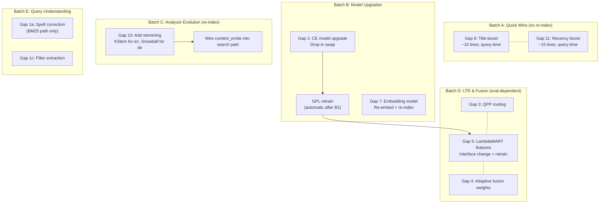

# 260: Search Pipeline — Gaps & Potential Improvements

**Status:** Research complete. No implementation started.
**Depends on:** 256 (component activation model), 251 (eval framework)
**Related:** 250 (pipeline routing architecture), 258 (search quality direction)

---

## Purpose

This tempdoc catalogs gaps in JustSearch's current search pipeline and
potential new components or improvements, based on a critical analysis of
the pipeline architecture against the 2025–2026 state of the art.

The goal is not to implement everything — it is to have a single reference
for what could be improved, with enough detail to evaluate priority.

---

## Current Pipeline Summary

JustSearch already has a strong multi-model pipeline:

- **3 retrieval legs**: BM25 (sparse), Dense KNN (nomic-embed-text-v1.5),
  SPLADE-v3 (learned sparse) — composable via `PipelineConfig` flags
- **RRF / CC fusion** with chunk-aware merge and parent collapse
- **2-stage reranking**: LambdaMART (fast, ~5 ms) → Cross-encoder
  (MiniLM-L6-v2, ONNX, deadline-budgeted)
- **LLM query expansion** (async, 1500 ms budget, morphological variants)
- **Structured execution reports** with per-component status/timing
- **Graceful degradation** with reason codes for every skip

Full details: [23-search-pipeline-overview.md](../explanation/23-search-pipeline-overview.md)

---

## Gap 1: No Query Understanding Layer

### Problem

The query string reaches retrieval legs essentially verbatim. The only
pre-retrieval processing is LLM expansion (morphological variants) and a
stop-word short-circuit. There is no:

- **Pre-retrieval spell correction.** Fuzzy correction exists but only as a
  zero-hit retry — the user sees an empty result set before the retry fires.
  Modern pipelines correct before retrieval (Lucene's `DirectSpellChecker`
  against the index, or an n-gram model).

- **Intent classification.** All queries are treated identically. A navigational
  query ("meeting-notes.pdf") and a conceptual query ("how does chunking work")
  receive the same retrieval strategy. Desktop search users frequently do
  filename/navigational searches.

- **Structured filter extraction from natural language.** Queries like "PDFs
  from last month" should extract `type:pdf` + `modified:last-month` as
  filters. The agent path does this via tool calls; the interactive search
  path doesn't.

- **Query rewriting beyond morphology.** No HyDE (Hypothetical Document
  Embedding), no sub-query decomposition, no synonym-aware rewriting based
  on the index vocabulary.

### Impact

Medium-High. Short, ambiguous, and navigational queries — common in desktop
search — suffer most.

### Possible approaches

| Approach                                       | Effort | Notes                                                               |
| ---------------------------------------------- | ------ | ------------------------------------------------------------------- |
| Lucene `DirectSpellChecker` pre-check          | Low    | Builds correction candidates from the index itself                  |
| Regex-based filter extraction                  | Low    | Handles `type:X`, date ranges, folder prefixes                      |
| LLM-based filter extraction                    | Medium | Generalizes to arbitrary natural language                           |
| HyDE for dense retrieval                       | Medium | Requires LLM to generate pseudo-doc; useful as retry for low-recall |
| Intent classifier (navigational vs conceptual) | Medium | Could route navigational queries to title/path BM25 only            |

---

## Gap 2: Cross-Encoder Model Is Outdated

### Problem

The cross-encoder uses **MiniLM-L6-v2**, released ~2021. This model is
estimated to be **8–12 nDCG@10 points below current SOTA** on the BEIR
benchmark.

Current landscape (2025–2026):

| Reranker               | nDCG@10 (BEIR) | Architecture                                     | Format         |
| ---------------------- | -------------- | ------------------------------------------------ | -------------- |
| Jina Reranker v3       | ~62            | "Last but not late" interaction; Qwen3-0.6B base | HF / API       |
| Jina Reranker v2-base  | ~57            | Cross-encoder                                    | ONNX available |
| BGE Reranker v2.5      | ~55            | Cross-encoder                                    | ONNX available |
| MiniLM-L6-v2 (current) | ~50 (est.)     | Cross-encoder                                    | ONNX           |

The cross-encoder is the **single highest-leverage stage** for relevance
quality — it's the last ordering decision before results reach the user.
An outdated model here directly caps end-to-end quality.

### Impact

High. Probably the single biggest quality bottleneck in the pipeline.

### Possible approaches

| Approach                             | Effort | Notes                                                                 |
| ------------------------------------ | ------ | --------------------------------------------------------------------- |
| Swap to Jina Reranker v2-base (ONNX) | Low    | Drop-in ONNX swap. ONNX runtime already integrated.                   |
| Swap to BGE Reranker v2.5 (ONNX)     | Low    | Same — drop-in.                                                       |
| Integrate Jina Reranker v3           | Medium | Likely needs ONNX export or a dedicated server process. Larger model. |
| GGUF cross-encoder via llama.cpp     | Medium | Would unify inference backend. GGUF reranker models are emerging.     |

---

## Gap 3: QPP Signals Are Computed But Unused

### Problem

The pipeline computes `maxIdf`, `avgIctf`, and `queryScope` per query term
in Worker stage 3 (QPP Computation). These signals are forwarded in the
response but **not used for routing decisions.**

tempdoc 256 Phase H2 (deferred) proposed query-adaptive mode selection:
- `queryScope < 0.01` (very rare terms) → add SPLADE for learned term
  expansion
- Short keyword query with high maxIdf → BM25-only (skip dense, save
  latency)
- Low maxIdf (all common terms) → weight dense higher

QPP++ 2025 (ECIR workshop) is actively researching QPP for LLM-era
retrieval routing and quality estimation.

### Impact

Medium. The infrastructure exists. The wiring is absent.

### Possible approaches

| Approach                      | Effort | Notes                                                |
| ----------------------------- | ------ | ---------------------------------------------------- |
| Threshold-based routing rules | Low    | Add `if` checks before dispatch based on QPP signals |
| QPP → adaptive RRF weights    | Low    | Feed signals into weight function                    |
| QPP → retrieval leg selection | Low    | Skip/add legs based on query characteristics         |
| Trained routing model         | High   | Needs labeled data; overkill for now                 |

---

## Gap 4: Static Fusion Weights

### Problem

RRF uses static K=60 and vectorWeight=0.75 for all queries. These weights
were chosen empirically and work well on average, but:

- Short keyword queries should weight BM25 higher
- Long conceptual queries should weight dense higher
- Rare-term queries benefit from SPLADE weighting
- Score distributions vary query-by-query; rank-based RRF ignores this

Industry trend: learned fusion and query-aware adaptive weights.

### Impact

Medium. The current static weights are a reasonable default but leave
quality on the table for edge-case query types.

### Possible approaches

| Approach                        | Effort      | Notes                                                                  |
| ------------------------------- | ----------- | ---------------------------------------------------------------------- |
| QPP-conditioned weight function | Low         | Simple function of queryScope/maxIdf → vectorWeight                    |
| Per-query score normalization   | Low         | Min-max normalize raw scores before fusion (CC mode exists but unused) |
| Trained fusion model            | Medium-High | Needs eval data. Learning to merge rank lists is well-studied.         |

---

## Gap 5: LambdaMART Has Only 2 Features

### Problem

The LambdaMART reranker uses only 2 features: sparse debug score and vector
debug score. This makes it essentially a learned linear combination of
BM25 and dense scores — not meaningfully different from adjusting RRF weights.

Modern LTR systems use 50–200 features:

- QPP signals (maxIdf, queryScope, avgIctf)
- Term overlap ratios (exact match %, partial match %, title match)
- Document static quality (freshness, length, format, title quality)
- BM25 sub-scores (title BM25 vs content BM25)
- Dense similarity sub-score
- SPLADE score
- Content preview length / readability

### Impact

Medium. More features would make LambdaMART a genuinely useful fast
pre-filter rather than a redundant scoring layer.

### Possible approaches

| Approach                     | Effort | Notes                                                      |
| ---------------------------- | ------ | ---------------------------------------------------------- |
| Add QPP + overlap features   | Low    | QPP already computed; overlap computable from match spans  |
| Add doc-static features      | Medium | Requires ingestion-time feature computation + storage      |
| Retrain with CE distillation | Medium | Use cross-encoder scores as labels for LambdaMART training |

---

## Gap 6: No Ingestion-Time Document Quality Signals

### Problem

The pipeline indexes content but doesn't compute **static document quality
features** at ingestion time:

- Document length (char count, token count)
- Format type (PDF, markdown, source code, etc.)
- Modification recency / freshness
- Title quality (has a meaningful title vs "untitled")
- Content density (text vs boilerplate ratio)
- Readability score

These would be stored as DocValues fields and available to LambdaMART and
the fusion stage at zero query-time cost.

### Impact

Low-Medium. Cheap to compute. Useful primarily as LTR features (Gap 5).

### Possible approaches

| Approach                             | Effort | Notes                                        |
| ------------------------------------ | ------ | -------------------------------------------- |
| Add DocValues fields during indexing | Low    | `FieldMapper` already controls field mapping |
| Compute at Tika extraction time      | Low    | Length, format, title already available      |
| Freshness from file metadata         | Low    | Modification timestamp already tracked       |

---

## Gap 7: Embedding Model Age

### Problem

nomic-embed-text-v1.5 (768-dim, Q8_0 GGUF via llama.cpp) was competitive
in 2024. The embedding landscape continues to advance:

| Model                           | Dims | Context | Format              | Notes                                      |
| ------------------------------- | ---- | ------- | ------------------- | ------------------------------------------ |
| nomic-embed-text-v1.5 (current) | 768  | 2048    | GGUF                | Solid but aging                            |
| nomic-embed-text-v2             | 768  | 8192    | GGUF (if available) | Long context                               |
| BGE-M3 (BAAI)                   | 1024 | 8192    | PyTorch/ONNX        | Dense + sparse + multi-vector in one model |
| Jina Embeddings v4              | 2048 | 8192    | Multiple            | Late-interaction capable                   |

A model upgrade would improve semantic retrieval quality but requires
**re-embedding the entire index**, which is a heavy operation.

The **late chunking** technique (Jina, 2024) is also relevant: embed the
full document first, then derive per-chunk embeddings from the full-context
token representations. This eliminates the "orphan chunk" problem but requires
a long-context model and pipeline restructure.

### Impact

Medium. Model upgrades are high-effort (full re-index) but can improve
dense retrieval quality. A prerequisite for late chunking.

### Possible approaches

| Approach                                      | Effort | Notes                                                       |
| --------------------------------------------- | ------ | ----------------------------------------------------------- |
| Upgrade to nomic-embed-v2 (if GGUF available) | Medium | Same inference backend; re-index required                   |
| Evaluate BGE-M3                               | High   | ONNX or Python runtime needed; replaces both embed + SPLADE |
| Implement late chunking                       | High   | Requires long-context model + pipeline restructure          |

---

## Gap 8: No Result Diversification for Interactive Search

### Problem

RAG retrieval applies MMR diversification (`RagContextOps`), but interactive
search does not. A broad query can return 10 near-duplicate results from
the same document family.

MMR (Maximal Marginal Relevance) iteratively selects results that are both
relevant to the query and dissimilar to already-selected results. A lambda
parameter controls the relevance-vs-diversity tradeoff.

SMMR (Sampled MMR, 2025) is a faster variant for large candidate sets.

### Impact

Low-Medium. More relevant for broad/ambiguous queries. Desktop search tends
toward specific queries, but the gap exists.

### Possible approaches

| Approach                                    | Effort | Notes                                                                |
| ------------------------------------------- | ------ | -------------------------------------------------------------------- |
| Adapt RagContextOps MMR to interactive path | Low    | Core logic exists; wrap in `KnowledgeHttpApiAdapter` post-reranking  |
| Add deduplication by doc family             | Low    | Collapse near-identical results (same parent folder, similar titles) |
| Configurable via PipelineConfig flag        | Low    | `diversifyEnabled` flag; default off                                 |

---

## Gap 9: No Title Boosting in Main BM25 Search

### Problem

`TextQueryOps` builds BM25 queries against the `content` field only. The
`title` field is not queried or boosted for interactive search. A user
searching for "meeting notes" will rank a document *titled* "Meeting Notes"
the same as one that merely mentions those words in paragraph 47.

Contrast with `SuggestOps`, which boosts title matches 4× for autocomplete.
The main search path doesn't do this.

Field-level boosting (title^N + content) is a basic relevance tuning
technique used by virtually every production search system.

### Impact

Medium. Title matches are strong precision signals, especially for
navigational queries (common in desktop search). Missing title boost means
navigational queries return noisy results.

### Possible approaches

| Approach                                   | Effort | Notes                                                   |
| ------------------------------------------ | ------ | ------------------------------------------------------- |
| Add `title` field to BM25 query with boost | Low    | ~10 lines in `TextQueryOps`; `title` is already indexed |
| Add `path` field with lower boost          | Low    | Useful for filename searches                            |
| Tune boost factors with eval framework     | Medium | Needs labeled data to find optimal title/content ratio  |

---

## Gap 10: No Stemming in the Analyzer Chain

### Problem

`SsotAnalyzerRegistry` uses: `ICUTokenizer → ICUNormalizer2 (NFC) →
LowerCaseFilter → SynonymGraphFilter`. **No stemming filter** is included.

This means a search for "running" will not match documents containing only
"run" or "runs" via BM25. Dense retrieval handles this implicitly (embeddings
capture morphological similarity), but BM25 — the backbone of the `text`
preset and a component of `hybrid` — misses these matches entirely.

The constraint "stemming + fuzzy are never simultaneous" already exists in the
pipeline, suggesting stemming was considered. It was apparently never added.

Modern Lucene pipelines typically include `EnglishMinimalStemFilter` or
`KStemFilter` for English. The challenge for JustSearch is that document
languages are unknown (mixed-language local files).

### Impact

Medium. Every BM25 query that uses inflected forms misses exact stem matches.
LLM expansion partially compensates (it generates morphological variants),
but expansion is only available for `text` and `splade` presets, not `hybrid`.

### Possible approaches

| Approach                               | Effort | Notes                                                                  |
| -------------------------------------- | ------ | ---------------------------------------------------------------------- |
| Add `KStemFilter` (English, light)     | Low    | Conservative stemmer; low false-positive rate                          |
| Add `EnglishMinimalStemFilter`         | Low    | Even lighter; handles plurals only                                     |
| Language-detect → per-language stemmer | High   | Tika extraction already detects language; chain per-language analyzers |
| "Stemmed" parallel field               | Medium | Index both stemmed and unstemmed; query both with different boosts     |

---

## Gap 11: No Recency / Freshness Boost

### Problem

JustSearch tracks file modification timestamps (stored in the index for
display and sorting), but **never uses them as a ranking signal.**

For desktop search, recently modified files are often more relevant than
older ones. A user searching for "project plan" likely wants the version
they edited yesterday, not the one from 2019.

Lucene supports recency boosting via `LongField.newDistanceFeatureQuery()`
which adds a decay-based boost to more recent documents. This is a standard
technique used by Elasticsearch, Solr, and most production search systems.

### Impact

Medium. Desktop search users strongly expect recent files to rank higher.
Current behavior ranks purely by textual relevance, ignoring temporal signals.

### Possible approaches

| Approach                                           | Effort | Notes                                                          |
| -------------------------------------------------- | ------ | -------------------------------------------------------------- |
| Lucene `DistanceFeatureQuery` on modification time | Low    | Built-in Lucene primitive; additive boost that decays with age |
| DocValues-based boost in RRF                       | Low    | Read mod-time at fusion stage; add small recency bonus         |
| LambdaMART recency feature                         | Low    | Add recency as an LTR feature (feeds Gap 5)                    |
| User-configurable recency weight                   | Medium | Settings toggle; some users want pure relevance                |

---

## Gap 12: No Implicit Relevance Feedback Loop

### Problem

JustSearch has no mechanism to learn from user behavior. No click logging,
no dwell-time tracking, no "result was opened" signals. Every search is
evaluated identically regardless of past interactions.

For a local-first desktop app, implicit feedback options are:
- **File open events**: Did the user open a search result? (Shell can track this)
- **Re-search patterns**: Did the user immediately re-search with a refined query?
  (Indicates the first result set was unsatisfactory)
- **Result position clicks**: Which rank position was clicked?

This data could feed LambdaMART retraining (Gap 5), adaptive fusion (Gap 4),
and QPP routing calibration (Gap 3).

### Impact

Low-Medium. Valuable long-term but requires privacy-conscious design (all
data local, user-controlled). Foundation for personalized search.

### Possible approaches

| Approach                                    | Effort | Notes                                                  |
| ------------------------------------------- | ------ | ------------------------------------------------------ |
| Log "file opened from search result" events | Low    | Shell → Head event; store locally                      |
| Click-position logging                      | Low    | Frontend reports which result rank was clicked         |
| Use logs for LambdaMART weak labels         | Medium | Clicks at rank 1 = positive; unclicked = weak negative |
| Privacy controls (opt-in, local-only)       | Low    | Essential for a local-first app                        |

---

## Gap 13: No Query Result Caching

### Problem

Every search query executes the full pipeline from scratch, even for
identical repeated queries. There is no query result cache at the Head or
Worker level.

Lucene provides segment-level caching internally (filter cache, OS page
cache for HNSW), but the application layer does not cache assembled
search responses.

Common repeated queries (e.g., user types, pauses, types more — the first
prefix query repeats if they backspace) pay full pipeline cost each time.

### Impact

Low. JustSearch is single-user, so cache hit rates are modest. But for
typing-driven search (search-as-you-type), caching the previous page's
results avoids redundant work.

### Possible approaches

| Approach                         | Effort | Notes                                                |
| -------------------------------- | ------ | ---------------------------------------------------- |
| LRU cache by query hash + config | Low    | Cache assembled response; invalidate on index commit |
| Debounce-aware caching           | Low    | Frontend already debounces; cache last N results     |
| Segment-generation cache key     | Medium | Lucene segment generation as cache invalidation key  |

---
## Investigation Findings (2026-03-05)

Codebase verification and internet research to ground each gap in reality.

### Codebase Findings

1. **Title boost (Gap 9) — confirmed trivial.**
   `TextQueryOps.buildSimpleContentQuery()` creates a `QueryParser` targeting
   `SchemaFields.CONTENT` only. The `title` field is already indexed via
   `FieldMapper`. Fix is ~10 lines: add a `BooleanQuery` with boosted title
   clause. `SuggestOps` already does title^4 — pattern exists.

2. **Stemming (Gap 10) — confirmed missing, no rationale.**
   `SsotAnalyzerRegistry.createIcuAnalyzer()` chain:
   `ICUTokenizer → ICUNormalizer2Filter → LowerCaseFilter → SynonymGraphFilter`.
   No stemming filter, no comment explaining the omission. Imports show only
   these four filters.

3. **Cross-encoder model swap (Gap 2) — confirmed clean.**
   `RerankerTokenizer` wraps `ai.djl.huggingface.tokenizers.HuggingFaceTokenizer`
   loaded from a filesystem `tokenizer.json`. `CrossEncoderReranker.rerank()`
   is fully generic ONNX: `tokenizer.encodePairs() → OnnxTensor → session.run()
   → extractScores()`. No model-specific preprocessing. Swap requires:
   (a) new `tokenizer.json`, (b) new ONNX model file, (c) possibly toggle
   `needsTokenTypeIds` flag. That's it.

4. **LambdaMART features (Gap 5) — confirmed exactly 2.**
   `RerankerService.rerank(float[] sparseScores, float[] vectors, int n)` —
   the interface itself hardcodes 2 feature arrays. Adding features requires
   changing the interface, the `LambdaMartReranker` implementation, and the
   feature injection site in `KnowledgeHttpApiAdapter`.

5. **Timestamp storage (Gap 11) — confirmed DocValues-backed.**
   `QueryFilterBuilder` line 127: `"// modified_at range filter (DocValues-backed)"`.
   Field `SchemaFields.MODIFIED_AT` is stored as DocValues.
   `LongField.newDistanceFeatureQuery()` can use this directly.

6. **Fuzzy correction (Gap 1) — confirmed zero-hit retry only.**
   `buildFuzzyTextQuery()` and `buildPerTermFuzzyQuery()` analyze → resolve
   closest indexed term per token → rebuild query. Called only when primary
   search returns 0 hits. Pre-retrieval spell correction would be a new
   early stage, no conflict.

### Internet Research Findings

7. **ONNX reranker availability (Q1) — answered.**
   - **Jina Reranker v2-base-multilingual**: ONNX on HuggingFace in FP16,
     int8, q4, uint8. 15× faster than BGE-v2-m3. ~190ms avg E2E latency.
   - **BGE Reranker v2-m3**: ONNX (`bge-reranker-v2-m3-onnx-o3-cpu`),
     CPU-optimized O3 variant available. Also int8 quantized variant.
   - Both are drop-in compatible with the existing `CrossEncoderReranker`.

8. **nomic-embed-text-v2 GGUF (Q on Gap 7) — available.**
   `nomic-ai/nomic-embed-text-v2-moe-GGUF` on HuggingFace, confirmed
   compatible with `llama.cpp`. Available since early 2025. MoE architecture.

9. **KStemFilter non-English safety (Q5) — unsafe.**
   KStemFilter is English-only. Applied to German/French/mixed text, it
   produces incorrect stems. For JustSearch (mixed-language local files),
   options: (a) language-gated stemming (Tika detects language at ingest),
   (b) dual-field approach (stemmed + unstemmed), (c) skip stemming for
   non-English-detected docs.

10. **Desktop search competitors (calibration) — confirmed gap is real.**
    Windows Search uses **title boost** (title matches rank higher) and
    **recency boost** (recently modified files rank higher). Both are
    standard. JustSearch does neither — we are behind the baseline
    desktop search experience.

### Codebase Findings — Round 2

11. **GPL training pipeline (Gap 5 context) — cross-encoder distillation.**
    `GplJobCoordinator` generates synthetic queries via LLM, scores with
    cross-encoder (`scoreQueryDoc()`), then runs them against the live index
    to capture BM25/vector scores + QPP signals + rank position. The NDJSON
    triple store already contains 5 extra features beyond the 2 used.
    `LambdaMartFeatureSchema` (74 lines) intentionally uses only `[sparse,
    vector]` — QPP was excluded by design: *"QPP values are constant within
    a query's result set, providing no intra-query discriminative gradient."*
    Adding features = change `LambdaMartFeatureSchema` + `RerankerService`
    interface + `LambdaMartReranker` impl + retrain.

12. **Title field schema — same analyzer as content.**
    SSOT `fields.v1.json`: `title` is type `"text"`, analyzer `"icu"` —
    identical to `content`. No analyzer mismatch risk for title boosting.
    Can use `MultiFieldQueryParser` or a `BooleanQuery` with both fields.

13. **SPLADE coupling — fully model-agnostic.**
    `searchSplade()` takes `Map<String, Float> queryWeights` and builds
    `FeatureField.newLinearQuery()`. Model inference is upstream (llama.cpp).
    Swapping the SPLADE model is transparent to the Lucene layer.

14. **Language-specific content fields already exist.**
    `fields.v1.json` defines `content_en` (analyzer: `"en"`) and
    `content_de` (analyzer: `"de"`). These may already include stemming
    via their language-specific analyzers. The `language` field (DocValues
    keyword) enables language-gated stemming at query time. Gap 10 may be
    partially addressed — needs verification of `"en"` and `"de"` analyzer
    definitions in the SSOT analyzers catalog.

---

## Cross-Reference: Existing Tempdoc Coverage

Reviewed all 81 tempdocs. **8 of 13 gaps have significant existing work;
3 gaps are effectively superseded.** Only 3 gaps are genuinely net-new.

| Gap    | Description                    | Existing Coverage                                                                                                                                                                                           | Status                                                                                                        |
| ------ | ------------------------------ | ----------------------------------------------------------------------------------------------------------------------------------------------------------------------------------------------------------- | ------------------------------------------------------------------------------------------------------------- |
| **1a** | Pre-retrieval spell correction | **223** implemented LLM query expansion (shipped). Fuzzy zero-hit retry exists in `SearchOrchestrator`. SPLADE v3 handles misspellings implicitly.                                                          | **Superseded** — LLM expansion + fuzzy retry + SPLADE cover this. Dedicated spell correction is low priority. |
| **1c** | Filter/intent extraction       | **250** Phase 4 → **256** component activation model (active). QPP routing researched but deferred.                                                                                                         | **Partially covered** — architectural investigation done, implementation deferred.                            |
| **2**  | Cross-encoder model upgrade    | **220** RAG-007: reranker upgrade blocked on eval harness. **253**: MiniLM-L2-v2 and Qwen3-Reranker-0.6B researched. **234** P2-A wires CE into GPL scoring.                                                | **Active blocker** — eval harness (216) is the gate, not discovery.                                           |
| **3**  | QPP-based query routing        | **234** P1-D: QPP telemetry implemented (MaxIDF, AvgICTF, QueryScope on the wire). **250** documents QPP routing as too low-ROI for corpus-level gating.                                                    | **Implemented but unused** — signals exist, routing logic deferred.                                           |
| **4**  | Adaptive fusion weights        | **234** P2-A: LambdaMART fusion implemented (replaces static RRF). CC alpha sweep done in **245**. 3-leg fusion blocked on **250** Phase 4.                                                                 | **Superseded** — LambdaMART IS adaptive fusion. Static weight tuning is moot.                                 |
| **5**  | LTR feature enrichment         | **234** P2-A: V1 features (sparse, vector, QPP×3). V2 (doc_length, is_chunk, content_type, freshness) is designed but deferred.                                                                             | **Partially done** — V1 shipped, V2 designed, implementation deferred.                                        |
| **6**  | Calibrated evaluation          | **245**: 4-dataset BEIR component isolation complete. **251**: realistic eval framework designed. **255**: eval pipeline research. **258**: strategic direction set.                                        | **Extensive coverage** — this is the most-researched topic across tempdocs.                                   |
| **7**  | Embedding model upgrade        | **253** Items 6 (context 8192) and 20 (Matryoshka 256-dim) both deferred. **220** RAG-008: BGE-M3 deferred.                                                                                                 | **Researched, deferred** — no embedding model change planned short-term.                                      |
| **8**  | Click/implicit feedback        | No tempdoc covers this.                                                                                                                                                                                     | **Net-new** — genuinely unaddressed.                                                                          |
| **9**  | Title field boosting           | No tempdoc covers this directly. **222** passage retrieval changes context (chunks have `CHUNK_CONTENT`). **220** ACC-003 notes match-pill heuristic (no title query).                                      | **Net-new** — title boost is unaddressed.                                                                     |
| **10** | Stemming/morphological         | **223** (47KB, deep research): ruled out index-time stemming (breaks fuzzy), implemented LLM expansion, evaluated on BEIR. Decision: ship LLM expansion.                                                    | **Superseded** — 223 made the definitive decision. Index-time stemming ruled out.                             |
| **11** | Recency boosting               | No tempdoc covers this. `modified_at` is DocValues-backed (confirmed).                                                                                                                                      | **Net-new** — recency boost is unaddressed.                                                                   |
| **12** | SPLADE model upgrade           | **253** Item 18: tested inference-free SPLADE (doc-v3-distill). **Negative result** — -0.040 to -0.060 nDCG@10 regression. SPLADE-v3 retained. IDF encoder infrastructure committed for future experiments. | **Investigated, negative** — current SPLADE-v3 is the right choice.                                           |
| **13** | Structured query syntax        | **250** P1 completed. **256** component activation model drafted.                                                                                                                                           | **Architecture addressed** — mode gating inconsistencies fixed.                                               |

### Key Implications

1. **The 3 genuinely net-new gaps are: title boost (9), recency boost (11),
   and click/implicit feedback (8).** These are our Batch A quick wins
   (9, 11) and a future-work item (8).

2. **Gaps 1a, 4, and 10 are superseded by existing decisions.** LLM query
   expansion replaces spell correction. LambdaMART replaces static fusion
   tuning. LLM expansion replaces index-time stemming. Tempdoc 260 should
   not propose re-opening these decisions without new evidence.

3. **Gaps 2, 5, and 7 are researched but blocked/deferred.** The blocker
   is the eval harness (tempdoc 216/251), not discovery. Model upgrades
   cannot be validated without realistic evaluation.

4. **Tempdoc 258 declares the strategic thesis:** JustSearch is not blocked
   by missing retrieval components — it's blocked by evaluation mismatch,
   regime mismatch, and ingestion quality. This aligns with the finding
   that most "gaps" in 260 are already addressed or researched.

---

## Phase 2: Theoretical Analysis (2026-03-05)

### Language-Specific Analyzers — No Stemming Anywhere

`analyzers.v1.json` defines four analyzers: `content_all` (locale `*`),
`content_en` (locale `en`), `content_de` (locale `de`), and `keyword`.
All three content analyzers use the same `"icu+synonyms"` provider with
locale-specific synonym files. **None include stemming.** The `"en"` and
`"de"` analyzers differ from the default only in which synonym file is
loaded — no Snowball, KStem, or language-specific stem filter exists.

**Implication:** Gap 10 (stemming) is fully unaddressed. The
language-specific fields exist as infrastructure for future language-aware
analysis, but currently only add synonym coverage — not morphological
normalization.

### Gap Interaction Risks

| Combination                              | Risk                                                                                                                                                         | Mitigation                                                                                                                                                                |
| ---------------------------------------- | ------------------------------------------------------------------------------------------------------------------------------------------------------------ | ------------------------------------------------------------------------------------------------------------------------------------------------------------------------- |
| **Title boost + recency boost**          | Compounds to over-promote recently-touched titled files. A renamed file gets both boosts simultaneously.                                                     | Use `SHOULD` clauses — both signals are additive, not multiplicative. Cap combined boost contribution or test combined effect via eval.                                   |
| **Stemming + fuzzy correction**          | Both expand recall. Stemmed index already matches morphological variants, so fuzzy correction may produce over-expanded result sets with low precision.      | Gate fuzzy correction: if stemming produced >0 hits, skip fuzzy retry. Alternatively, reduce edit distance when stemming is active.                                       |
| **CE model upgrade → LambdaMART labels** | New CE model produces different score distributions. Existing GPL triples use old CE scores as labels. LambdaMART model trained on old labels becomes stale. | **Sequence: CE upgrade BEFORE GPL retrain.** New triples generated with new CE labels will retrain LambdaMART correctly. Old triples should be discarded or re-scored.    |
| **Title boost + SPLADE**                 | SPLADE already does learned term importance. If SPLADE up-weights title terms, explicit title^3 compounds with learned weights.                              | Title boost applies only to the BM25 leg. In SPLADE mode, BM25 is replaced, so title boost is bypassed. **No conflict** — the two modes are mutually exclusive per query. |
| **Recency boost + evaluation**           | Recency boost changes result ordering. Existing eval judgments (based on content relevance) may disagree with recency-boosted ordering.                      | Add recency as a separate eval dimension. Or: evaluate with and without recency to isolate its impact.                                                                    |

### SPLADE v3 and Spell Correction Redundancy

SPLADE v3 performs learned query expansion including typo correction via
contextual token expansion. When SPLADE mode is active, pre-retrieval
spell correction (Gap 1a) is **partially redundant** — SPLADE already
handles the most common misspelling patterns.

**However**, SPLADE is not always active:
- TEXT mode (BM25-only): no SPLADE expansion → spell correction is
  the only typo-handling mechanism beyond zero-hit fuzzy retry
- HYBRID mode with BM25 leg: BM25 leg gets no SPLADE expansion

**Recommendation:** Implement spell correction for the BM25 path. When
SPLADE is active, skip the spell correction stage (it wastes CPU on work
SPLADE already does). This aligns with the QPP routing pattern — use
query signals to decide which stages run.

### Zero-Hit Fallback Chain Assessment

Current chain in `SearchOrchestrator`:
1. Primary search (BM25/SPLADE/Hybrid)
2. Zero-hit fuzzy retry: `buildFuzzyTextQuery()` with configurable
   `maxEditDistance` and `dfThreshold`
3. Per-term correction: `buildPerTermFuzzyQuery()` — corrects only
   unmatched tokens, preserves matched ones
4. `hybridFallback`: if vector search fails, falls back to text-only

**Assessment:** The chain is solid for BM25 mode. Gaps:
- **No fallback for SPLADE mode.** If SPLADE returns zero hits (possible
  for niche vocabulary), there is no retry mechanism.
- **No "did you mean?" UX.** The corrected query is computed but only
  used silently — no user-facing suggestion.
- **No query relaxation.** If all terms are rare, dropping the rarest
  term and retrying could improve recall.

### Implementation Batching Strategy

**Ordering:** A → B → C → D → E

| Batch                   | Effort      | Re-index | Eval needed    | Can parallelize                |
| ----------------------- | ----------- | -------- | -------------- | ------------------------------ |
| A (Quick wins)          | Low         | No       | Optional       | Yes (A1 ∥ A2)                  |
| B (Model upgrades)      | Medium      | B3 only  | For validation | B1 → B2 serial; B3 independent |
| C (Analyzer)            | Medium      | Yes      | For validation | C1 → C2 serial                 |
| D (LTR/Fusion)          | Medium-High | No       | Required       | D1 first, D2/D3 after          |
| E (Query understanding) | Low-Medium  | No       | Optional       | E1 ∥ E2                        |

---

## Implementation Priority

Ordered by estimated impact-to-effort ratio:

| #   | Gap                                     | Effort | Impact  | Depends on                              |
| --- | --------------------------------------- | ------ | ------- | --------------------------------------- |
| 1   | Cross-encoder model upgrade (Gap 2)     | Low    | High    | Model availability; ONNX runtime exists |
| 2   | Title boosting in BM25 (Gap 9)          | Low    | Medium  | ~10 lines in `TextQueryOps`             |
| 3   | QPP-driven routing (Gap 3)              | Low    | Medium  | Eval framework for threshold tuning     |
| 4   | Recency / freshness boost (Gap 11)      | Low    | Medium  | Lucene `DistanceFeatureQuery`           |
| 5   | Pre-retrieval spell correction (Gap 1a) | Medium | Medium  | Lucene `DirectSpellChecker`             |
| 6   | Stemming in analyzer chain (Gap 10)     | Low    | Medium  | Re-index needed; `KStemFilter`          |
| 7   | LambdaMART feature enrichment (Gap 5)   | Medium | Medium  | Gap 6 (doc quality signals); retraining |
| 8   | Adaptive fusion weights (Gap 4)         | Low    | Medium  | Eval framework for validation           |
| 9   | Structured filter extraction (Gap 1c)   | Low    | Medium  | Regex patterns first; LLM later         |
| 10  | Ingestion-time quality signals (Gap 6)  | Low    | Low-Med | Feeds Gap 5                             |
| 11  | Result diversification (Gap 8)          | Low    | Low-Med | MMR exists in RAG path                  |
| 12  | Implicit feedback loop (Gap 12)         | Low    | Low-Med | Privacy controls; long-term value       |
| 13  | Query result caching (Gap 13)           | Low    | Low     | Single-user limits cache hit rate       |
| 14  | Embedding model upgrade (Gap 7)         | High   | Medium  | Re-index required                       |

---

## Open Questions

- [x] Q1: Which ONNX cross-encoder models are available at sizes suitable
  for local inference (~100–500 ms per batch)?
  → **Answered.** Jina Reranker v2-base (ONNX, FP16/int8/q4, ~190ms).
  BGE Reranker v2-m3 (ONNX, CPU-optimized O3 variant). Both drop-in.
- [x] Q2: Should QPP routing decisions live in the Worker (before dispatch)
  or in the Head (before gRPC call)?
  → **Answered.** QPP signals are query-level, not pairwise. The
  `LambdaMartFeatureSchema` Javadoc confirms QPP was intentionally
  excluded from LambdaMART. QPP belongs in the **routing/gating layer**
  (pre-search), not reranking. Worker already computes QPP via
  `getQppSignals()` and returns it in the SearchResponse.
- [x] Q3: Is there labeled data or click-log data available for LambdaMART
  retraining, or should we bootstrap from cross-encoder distillation?
  → **Answered.** Cross-encoder distillation. `GplJobCoordinator`
  generates synthetic queries via LLM, scores query-doc pairs with the
  cross-encoder (`scoreQueryDoc()`), and writes the scores as labels to
  the NDJSON triple store. No click-log infrastructure exists (Gap 12).
- [x] Q4: Should spell correction be a Head-side stage (before gRPC) or
  Worker-side (where the index lives for `DirectSpellChecker`)?
  → **Answered.** Worker-side. `DirectSpellChecker` needs IndexReader,
  which lives in Worker. Fuzzy correction already follows this pattern.
- [x] Q5: Is `KStemFilter` safe for mixed-language documents, or should
  stemming be gated by a language-detection heuristic?
  → **Answered.** Unsafe. KStem is English-only, produces garbage on
  non-English. Must be language-gated or use dual-field approach.
  Language-specific fields (`content_en`, `content_de`) already exist
  in the SSOT catalog.
- [x] Q6: What recency decay curve is appropriate for desktop search?
  → **Answered.** Use `DistanceFeatureQuery` with formula
  `score = boost * pivot / (pivot + distance)`. Industry convention for
  desktop/personal search: **start with pivot = 30 days** (half-score
  at 30 days old). This is the Elasticsearch/OpenSearch recommended
  starting point. Tune via eval framework after deployment. Score decays
  smoothly — no hard cutoff.
- [x] Q7: Should title boost factor be fixed (e.g., title^3) or tunable
  via the eval framework?
  → **Answered.** Industry range is **2×–5×** for title boost.
  Elasticsearch tutorials use `title^2`–`title^4`; Solr best practice
  guides use `title^5` (in `qf=title^5 body^1`). **Start with
  title^3** — moderate, well within the industry norm. BM25's field
  length normalization already gives title matches a natural advantage
  (shorter field = higher score per term), so the explicit boost
  multiplies on top of that. Tune via eval framework later.
